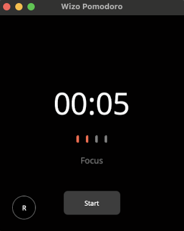
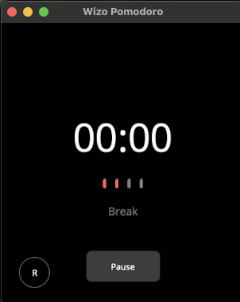

# Wizo Pomodoro

Wizo Pomodoro is a simple and clean Pomodoro Timer built in C# using .NET MAUI for macOS.

### Features
- 🔥 Streaks
- 📆 Progress
- 🎧 Custom Focus Sessions

### How it Looks (1.0.0)

